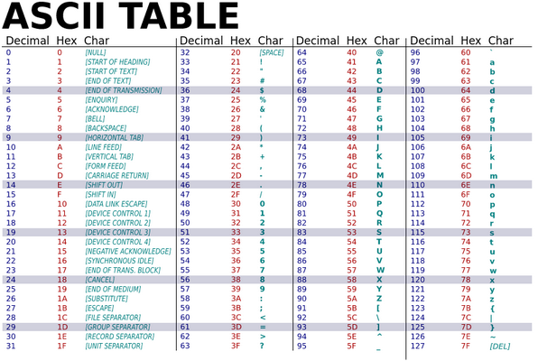
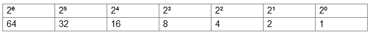
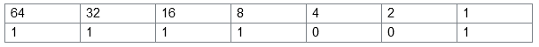
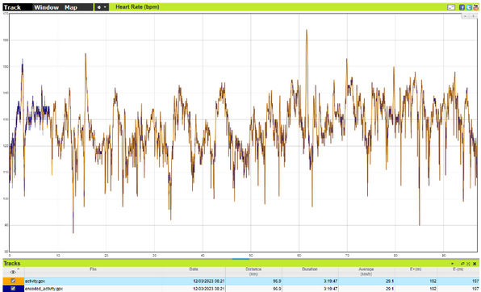
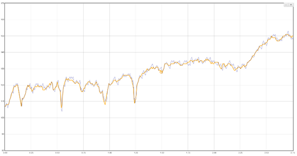

# Proof of concept: hiding secret messages in Garmin activity files

<i>Disclaimer: I have carefully considered whether I should make my form of steganography public. Like any technique, steganography is a two-edged sword; after all, you can do good or evil with it. Because there are already many forms of steganography, this form will add little in practice. Nevertheless, there is still plenty to be gained in providing information about steganography. That is why I chose to make my study public.</i>

One who has a secret, wants to keep it probably private. It is therefore not surprising that secrecy holders put effort in preventing their messages become public. A well-known example dates back to the ancient Greece, roughly to 440 years before Christ. At that time, a Greek named Histiaeus sent a message to his vassal by shaving the head of a trusted servant, ‘marking’ a message onto his scalp, and sending him on his way once his hair had regrown.

The art of hiding secret data within an ordinary, non-secret, file or message in order to avoid detection is called steganography. This word comes from Greek steganographia, which combines the words steganós (‘covered or concealed’), and graphia (‘writing’). Apart from the story about Histiaeus, other examples of steganography in history include the use of invisible ink and subtle indentations in paper.

Since the emergence of computers it has also been possible to disguise information in digital files. Almost every digital file can be used to hide secret information. At a consequence, it has been very difficult to detect the use of digital steganography - especially due to the diversity of digital files.

A recent example of digital steganography dates from 2018, when security researcher David Buchanan shocked friend and foe by  [putting the complete work of William Shakespeare in a picture](https://www.vice.com/en/article/bj4wxm/tiny-picture-twitter-complete-works-of-shakespeare-steganography,), and then spreading that picture worldwide in one single tweet on Twitter.

It took Buchanan months to find a way to put a large blob of so-called ICC metadata in his image, he told Motherboard. While Twitter extracted most of the metadata from images, the service did not strip the ICC data - a major chance for Buchanan to hide data in it.

Years later Buchanan's work can still be downloaded locally via the curl command below (to prevent unwanted clicks, the t's in http have been replaced by an 'x' and the dots have been placed in square brackets):

    curl 'hxxps://pbs[.]twimg[.]com/media/DqteCf6WsAAhqwV[.]jpg' >> data.zip && unzip data.zip && unrar x shakespeare.part001.rar

Buchanan's example is relatively innocent. However, digital steganography has less innocent forms as well. In 2020, cybersecurity company Sansec found malware  [posing as social media buttons on websites](https://sansec.io/research/svg-malware). The buttons contained a piece of code - a payload - which, once decrypted, was used to execute other malicious code. The payload was hidden in the path elements of an svg element, making the attack very difficult to detect in many ways.

In addition to the examples aforementioned, there are countless other forms of digital steganography. Currently, five categories are known to date, namely steganography in images, in video files, in audio files, in network traffic, and in text files.

In this post, I introduce a novel form of digital steganography: hiding secret messages in heart rate values of sport devices. My example serves two purposes: first, to show that it is possible to hide messages in gpx files. And, secondly, that everyone should be aware that all digital files can contain a message. This is especially important, for example, for cybersecurity companies and law enforcement services.

My form of digital steganography uses a so-called gpx file as carrier. Gpx stands for GPS Exchange Format file and is actually an XML scheme that can contain geographical information, such as waypoints, tracks and routes. In addition, a gpx file can also contain additional metadata, such as biometric data of a person while following a certain route. For example, the popular sports watch maker Garmin puts heart rates in a gpx file when the watch registers an activity.

To show what a gpx looks like, I made an export of a sports activity I previously recorded with a Garmin watch (the coordinates are changed). Below I show an abbreviated version. The trkpt element shows what my exact location was on a given moment in time. On that moment, on that location, I had a heart rate of 107 and a cycling cadence of 69.

    <?xml version="1.0" encoding="UTF-8"?>
    <gpx creator="Garmin Connect" version="1.1"
      xsi:schemaLocation="http://www.topografix.com/GPX/1/1 http://www.topografix.com/GPX/11.xsd"
      xmlns:ns3="http://www.garmin.com/xmlschemas/TrackPointExtension/v1"
      xmlns="http://www.topografix.com/GPX/1/1"
      xmlns:xsi="http://www.w3.org/2001/XMLSchema-instance" xmlns:ns2="http://www.garmin.com/xmlschemas/GpxExtensions/v3">
      <metadata>
        <link href="connect.garmin.com">
          <text>Garmin Connect</text>
        </link>
        <time>2023-03-12T07:21:12.000Z</time>
      </metadata>
      <trk>
        <name>Cycling</name>
        <type>road_biking</type>
        <trkseg>
          <trkpt lat="3.56294" lon="175.66769">
            <ele>6.599999904632568359375</ele>
            <time>2023-03-12T07:21:12.000Z</time>
            <extensions>
              <ns3:TrackPointExtension>
                <ns3:atemp>9.0</ns3:atemp>
                <ns3:hr>107</ns3:hr>
                <ns3:cad>69</ns3:cad>
              </ns3:TrackPointExtension>
            </extensions>
          </trkpt>
          <trkpt ...>
             ...
          </trkpt>
        </trkseg>
      </trk>
    </gpx>

My idea is this: without adding fields, can I hide information in a gpx file? And if so, can I easily share that disguised information with others?

When analyzing my own gpx file, I found out that my Garmin device saves a trkpt record per second. This means that every workout second we have a record to put data into.

The first idea I had was to add a new data field in each record where I put my secret text. However, it turned out this was a big risk as well, since my new data field was not formally known in the gpx specifications. As a consequence, services like Strava, TrainingPeaks or Gamin Connect may strip my secret message, which means my hidden information may get lost.

My second idea involved modifying an existing value. The reason behind this was twofold. Primarily, the gpx still met specs so services wouldn't reject the file. Secondly, it made it possible, with a tiny adjustment, to hide information that no one would ever discover.

Eventually, I chose the heart rate value to put information in. I left the cadence information for what it was. However, that doesn't mean it wouldn't be suitable; the choice of heart rate was entirely arbitrary.

In order to misuse the heartbeat to hide a message, I had to convert my message into something that can be easily translated into a heartbeat. Because a heart rate value is a number, my message must also be converted to a number. Binary code seemed extremely suitable for this. A 1 or a 0 is such a small number that hiding such a number in a heartbeat would hardly be noticed, or so I thought.

A binary value is just a logical state that is formally known as 1 or 0 (true and false, respectively). If you are not familiar with binary values, you must know that all digital information is built with binary values. One 1 or one 0 is called a ‘bit’.

To convert binary information to something like the text you are actually reading right know, the computer must ‘translate’ the information. A traditional way for translating the information, is to convert a combination of bits (a so-called bit array) to text by using the ASCII table.



The ASCII table.

You need to know that the ASCII table is a character encoding standard for electronic communication. Every character in the ASCII table is equal to a specific binary value. For instance, by using the table, the binary value of ‘1111001’ can be converted to the letter ‘y’.

Let me explain. The ASCII table is a 7-bit system. This means that all characters have a binary representation that is exactly 7 bits long. Each bit represents increasing powers of 2, starting with 2⁰. On most systems, when you are reading binary, you must start with the right-most digit and work to the left.



The ASCII system supports 128 different numerical values.

If we have binary value of ‘1111001’, this means the following:



Which means: 64 + 32 + 16 + 8 + 1 = 121. According to the ASCII table, as is shown above, this is ‘y’, which is correct.

If we set all binary values to ‘1’, this means a maximum number of 127. As a consequence, the use of the ASCII table is limited to 127 possibilities. For my use case, this is fine, but if we need to implement this for other characters, such as Japanese, we need another encoding standard.

Now, without any hassle, let’s continu to my implementation of text steganography. I wrote a script (for the it nerds: in Python) that can convert a hidden message of text (a so-called string) to the binary representation. This means that the text 'My secret text' is converted to ‘01101101 01111001 00100000 01110011 01100101 01100011 01110010 01100101 01110100 00100000 01110100 01100101 01111000 01110100'.

After this, it was important to hide these ones and zeros in the heartbeats. For this it was first of all necessary to retrieve and collect all heartbeats from the gpx in a list. Such a list could look like this:

```
# List of heartbeats in Python
heart_beats = [150, 153, 151, 152, 152, 150, 150, 151, 152, ...]
```

The easiest would be to add those ones and zeroes to the heartbeats. But this poses a practical problem: how can we then read the hidden message later? After all, we cannot see whether the heart rate has been adjusted with a 1 or a 0.

This is why I came up with the concept of 'sectors'. Sectors are actually sub-lists of the list of heartbeats. Each sub-list contains a starting position, where the next heartbeats depend on.

The length of the sectors - so the amount of sub-lists - was determined by the former two heartbeats from the list of heartbeats. In the example you see that the first values are 150 and 153. A simple calculation shows that 153 - 150 = 3. This means that the length of a sub-list is 3.

By working with the first two heartbeats, it is possible to differentiate. This means that one secret message is not the other, because it might work with smaller or larger sub-lists. In theory, this makes it even more difficult to discover. If the calculated sector length is less than 2, a standard length of 2 used by the algorithm.

Now that we know that the sector length in this particular example is 3, we can split the heartbeats into sectors:

```
# List of sectors in Python
sectors = [[150, 153, 151], [152, 152, 150], [150, 151, 152], ...]]
```

From now on we can hide our message. For this, we use the following rules:

-   Always ignore the first sector, since it contains information about the sector size. We do not want to override this one, otherwise we are unable to decode our encoded message later;
-   First number in the sector is checked on even or odd. Even means 0, odd means 1. If the bit is 0 and the number is odd, than raise the number with 1. Is the bit is 1 and the number is even, than lower the number with 1;
-   For subsequent numbers in the same sector: if the bit is 1, the value should be higher than the previous one. If the bit is 0, the value should be lower.

Example:

```
Binary value: 010
sector: [152, 152, 150]
```

We see that 152 is the first number of the sector. This is an even number. Because the first bit is a 0, we keep 152.

We see that the second bit is a 1 and the second number from the sector is 152. Based on predetermined rules, we know that a subsequent number in a sector uses the previous number to determine whether it is a 0 or a 1. To ‘translate’ the 152 into a binary value of 1, we must therefore increase this number by 1: 153.

We see that the third number is 150 and the third bit is 0. We look again at the previous number, which is the increased value of 153. Because 150 is lower than 153, 150 represents a binary value of 0, and we can keep 150. So the result is:

```
Binary value: 010
sector: [152, 153, 150]
```

What does this mean in practice? I stored my hidden message in a gpx file, and created a new gpx file with my converted values. Then I compared the old and the new gpx files in the online tool  [mygpsfiles.com](http://mygpsfiles.com).



A screenshot of the two gpx files that are loaded in mygpsfiles.com.

The old activity is shown in the orange color, the activity with the hidden message is shown in the blue color. It can be seen how the new heartbeat follows the same pattern as the first heartbeat. Let's zoom in:



The gpx files in detail.

The graph above shows the heart rate on the y-axis and the distance in kilometers the x axis. We see the heartbeats in a period of approximately 6 minutes. 6 minutes contain 6 * 60 = 360 seconds, and therefore 360 bits. We know we need 8 bits for it writing one 8-bit ascii character. So, minus the first sector, there are more than enough in this piece 40 ascii characters disguised (in this case the hidden message is something other than "My secret text").

We see that the blue line has become a bit more angular than the orange line, but again we also find that the blue line follows approximately the same pattern as the orange line. Only someone who looks at the heartbeats on a level of seconds may guess that there is something not right. I think, in practice, there won't be many.

Finally, we can upload the gpx file to a service such as Garmin Connect or Strava, so that we can share the gpx file with other athletes. They can all download the gpx again and deconvert it in order to see the hidden message.

There are several scenarios to think about how this form of steganography can be useful. Consider, for example, covert services that must provide information of certain inhabitants of a country with a criminal regime, who would like something to do with them to inform family abroad. Another practical example is to hide valuable passwords or PIN codes in this way, such as a master passphrase for a Keepass file.

It is very difficult for digital investigators to see a gpx file of a hidden message, but it is possible. The algorithm shown above in summary has one weakness: values in sectors must always be higher or lower than previous values are to express a binary value (hence the angular shapes in the graph). In 'real' scenarios, it's really not likely that a heartbeat differs every second . In fact, it is very likely that a heartbeat is often the same for several seconds.

To test my hypothesis, I once again wrote a script that can trace hidden messages in gpx files. To detect the messages, the script first reads the heartbeats of gpx files that have not been manipulated, preferably files that are registered with the same device as the one used by the manipulated file. It then calculates how many heart beats in these gpx files were equal on average (had a difference of 0). This creates a baseline we can work with.

After this, the script calculates how many heartbeats were equal on average in the manipulated gpx file. This average is then compared to the baseline. If the mean is lower than the baseline, we're probably dealing with a manipulated file.

It is important to mention that the test script only looks at the heartbeats of the first 60 seconds. The rest of the heartbeats are irrelevant to the test because they even can make the test more inaccurate.

The complete script for hiding information in gpx files, including encoder, decoder and detection script, can be found at:  [https://github.com/YoeriNijs/hr_steganography](https://github.com/YoeriNijs/hr_steganography)[.](https://github.com/YoeriNijs/hr_steganography.) Just run the main script to get started:

```
python ./main.py
```

Now you know what steganography is, and what its power is. You now also know why it is important never to take digital files for granted: there may be a hidden message in them.
